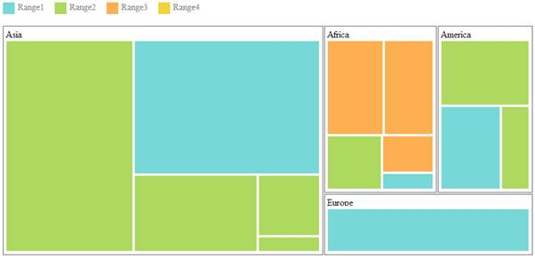
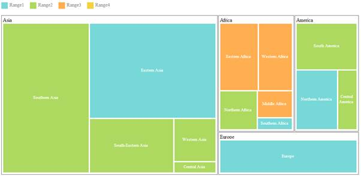

# TreeMap Elements

TreeMap contains various elements such as,

* Legend
* Headers
* Labels

### Legend

You can set the color value of leaf nodes using TreeMapLegend. This legend is appropriate only for the TreeMap whose leaf nodes are colored using RangeColorMapping.

You can set ShowLegend property value to “True” to enable or disable legend visibility.

## TreeMap Legend

You can decide the size of the legend icons by setting IconWidth and IconHeight properties of the TreeMapLegend property avail in TreeMap.

### Label for Legend

You can customize the labels of the legend item using LegendLabel property of RangeColorMapping. 



protected void Page_Load(object sender, EventArgs e)

{
    this.treemap.DataSource = TreeMapPopulationData.GetData();

}





    <ej:Treemap ID="treemap" runat="server" ColorValuePath = "Growth" WeightValuePath = "Population" ShowLegend = "true" >

       <TreeMapLegend IconHeight = "17" IconWidth = "17"></TreeMapLegend>

        <LeafItemSettings LabelPath = "Country"></LeafItemSettings>

        <TreeMapRangeColorMappings>

             <ej:TreeMapRangeColorMapping Color = "#77D8D8" Legendlabel = "1% Growth" From = "0" To = "1"></ej:TreeMapRangeColorMapping>

             <ej:TreeMapRangeColorMapping Color = "#AED960" Legendlabel = "2% Growth" From = "0" To = "2"></ej:TreeMapRangeColorMapping>

             <ej:TreeMapRangeColorMapping Color = "#FFAF51" Legendlabel = "3% Growth" From = "0" To = "3"></ej:TreeMapRangeColorMapping>

             <ej:TreeMapRangeColorMapping Color = "#F3D240" Legendlabel = "4% Growth" From = "0" To = "4"></ej:TreeMapRangeColorMapping>

        </TreeMapRangeColorMappings>

        <Levels>

            <ej:TreeMapLevel GroupPath = "Continent" GroupGap = "5" HeaderHeight = "25"></ej:TreeMapLevel>

        </Levels>

    </ej:Treemap>

	


 

### Header

You can set headers for each level by setting the ShowHeader property of the each TreeMap levels. The HeaderHeight property helps to set the height of the header and Group path value determines the header value. You can customize the default header appearance by setting the HeaderTemplate of the TreeMap levels.




protected void Page_Load(object sender, EventArgs e)

{
    this.treemap.DataSource = TreeMapPopulationData.GetData();
}





    <ej:Treemap ID="treemap" runat="server" ColorValuePath = "Growth" WeightValuePath = "Population" ShowLegend = "true" >

       <TreeMapLegend IconHeight = "17" IconWidth = "17"></TreeMapLegend>

        <LeafItemSettings LabelPath = "Country"></LeafItemSettings>

         <TreeMapRangeColorMappings>

             <ej:TreeMapRangeColorMapping Color = "#77D8D8" Legendlabel = "1% Growth" From = "0" To = "1"></ej:TreeMapRangeColorMapping>

             <ej:TreeMapRangeColorMapping Color = "#AED960" Legendlabel = "2% Growth" From = "0" To = "2"></ej:TreeMapRangeColorMapping>

             <ej:TreeMapRangeColorMapping Color = "#FFAF51" Legendlabel = "3% Growth" From = "0" To = "3"></ej:TreeMapRangeColorMapping>

             <ej:TreeMapRangeColorMapping Color = "#F3D240" Legendlabel = "4% Growth" From = "0" To = "4"></ej:TreeMapRangeColorMapping>

        </TreeMapRangeColorMappings>

        <Levels>

            <ej:TreeMapLevel GroupPath = "Continent" GroupGap = "5" HeaderHeight = "25"></ej:TreeMapLevel>

        </Levels>

    </ej:Treemap>

    
 




  

### Label

You can also set labels for the leaf nodes by setting the ShowLabels property as true. Group path value is displayed as a label for leaf nodes. You can customize the default label appearance by setting the LabelTemplate of the TreeMap levels.




protected void Page_Load(object sender, EventArgs e)

{

    this.treemap.DataSource = TreeMapPopulationData.GetData();

}





    <ej:Treemap ID="treemap" runat="server" ColorValuePath = "Growth" WeightValuePath = "Population" ShowLegend = "true" >

       <TreeMapLegend IconHeight = "17" IconWidth = "17"></TreeMapLegend>

        <LeafItemSettings LabelPath = "Country"></LeafItemSettings>

		<TreeMapRangeColorMappings>

             <ej:TreeMapRangeColorMapping Color = "#77D8D8" Legendlabel = "1% Growth" From = "0" To = "1"></ej:TreeMapRangeColorMapping>

             <ej:TreeMapRangeColorMapping Color = "#AED960" Legendlabel = "2% Growth" From = "0" To = "2"></ej:TreeMapRangeColorMapping>

             <ej:TreeMapRangeColorMapping Color = "#FFAF51" Legendlabel = "3% Growth" From = "0" To = "3"></ej:TreeMapRangeColorMapping>

             <ej:TreeMapRangeColorMapping Color = "#F3D240" Legendlabel = "4% Growth" From = "0" To = "4"></ej:TreeMapRangeColorMapping>

        </TreeMapRangeColorMappings>

        <Levels>

            <ej:TreeMapLevel GroupPath = "Continent" GroupGap = "5" HeaderHeight = "25"></ej:TreeMapLevel>

        </Levels>

    </ej:Treemap>

	



 

## Customizing the Overflow labels

You can handle the label overflow, by specifying any one of the following values to the property `TextOverflow`as

**None**       - By specifying textOverflow as “none”, it displays the default label text.
**Hide**       - By specifying textOverflow as “hide”, You can hide the label, when it exceeds the header width.
**Wrap**       - By specifying textOverflow as “wrap”, you can wrap the label text.
**Wrapbyword** - By specifying textOverflow as “wrapbyword”, you can wrap the label text by word.



    <ej:Treemap ID="treemap" runat="server" ColorValuePath = "Growth" WeightValuePath = "Population" ShowLegend = "true" >

       <TreeMapLegend IconHeight = "17" IconWidth = "17"></TreeMapLegend>

        <LeafItemSettings LabelPath = "Country" TextOverFlow = "Wrap"></LeafItemSettings>
		
        <Levels>

            <ej:TreeMapLevel GroupPath = "Continent" GroupGap = "5" HeaderHeight = "25"></ej:TreeMapLevel>

        </Levels>

    </ej:Treemap>

	
