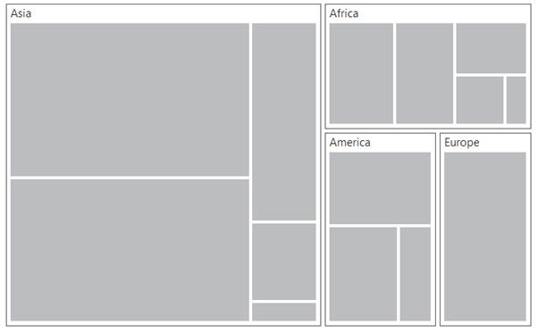

# TreeMapLevels

The levels of TreeMap can be categorized into two types as,

* FlatLevel
* Hierarchical Level

## Flat Level

Group Path

You can use GroupPath property for every flat level of the TreeMap control. It is a path to a field on the source object that serves as the “Group” for the level specified. You can group the data based on the GroupPath in the TreeMap control. When the GroupPath is not specified, then the items are not grouped and the data is displayed in the order specified in the DataSource.

Group Gap

You can use GroupGap property to separate the items from every flat level and to differentiate the levels mentioned in the TreeMap control.



[ASP]

[ASPX.CS]

  protected void Page_Load(object sender, EventArgs e)

        {

            this.treemap.DataSource = TreeMapPopulationData.GetData();

        }

[ASPX]

&lt;ej:Treemap ID="treemap" runat="server" WeightValuePath = "Population" ColorValuePath = "Growth"&gt;

&lt;Levels&gt;

       &lt;ej:TreeMapLevel GroupPath = "Continent" GroupGap = "5" HeaderHeight = "25"&gt;

       &lt;/ej:TreeMapLevel&gt;

&lt;/Levels&gt;

&lt;/ej:Treemap&gt;



{:.image }

## HierarchicalLevel

TreeMap Hierarchical level is used to define levels for hierarchical data collection that contains tree-structured data.



[ASP]

[ASPX.CS]

public partial class flatcollection : Page

    {

        protected void Page_Load(object sender, EventArgs e)

        {

            this.treemap.DataSource = SalesData.GetData();

       }

   }

public class SalesData

    {

        public string Country { get; set; }

        public string Name { get; set; }

        public double Sales { get; set; }

        public double Expense { get; set; }

        public static List<SalesData> GetData()

        {

            List<SalesData> lt = new List<SalesData>();

            lt.Add(new SalesData() { Country = "United States", Name = "New York", Sales = 2353, Expense = 2000 });

            lt.Add(new SalesData() { Country = "United States", Name = "Los Angeles", Sales = 3453, Expense = 3000 });

            lt.Add(new SalesData() { Country = "United States", Name = "San Francisco", Sales = 8456, Expense = 8000 });

            lt.Add(new SalesData() { Country = "United States", Name = "Chicago", Sales = 6785, Expense = 7000 });

            lt.Add(new SalesData() { Country = "United States", Name = "Miami", Sales = 7045, Expense = 6000 });

            lt.Add(new SalesData() { Country = "Canada", Name = "Toronto", Sales = 7045, Expense = 7000 });

            lt.Add(new SalesData() { Country = "Canada", Name = "Vancouver", Sales = 4352, Expense = 4000 });

            lt.Add(new SalesData() { Country = "Canada", Name = "Winnipeg", Sales = 7843, Expense = 7500 });

            lt.Add(new SalesData() { Country = "Mexico", Name = "Mexico City", Sales = 7843, Expense = 6500 });

            lt.Add(new SalesData() { Country = "Mexico", Name = "Cancun", Sales = 6683, Expense = 6000 });

            lt.Add(new SalesData() { Country = "Mexico", Name = "Acapulco", Sales = 2454, Expense = 2000 });

            return lt;

        }

    }

[ASPX]

&lt;ej:Treemap ID="treemap" runat="server" WeightValuePath = "Population" ColorValuePath = "Growth"&gt;

&lt;/ej:Treemap&gt;       



 
{:.image }

