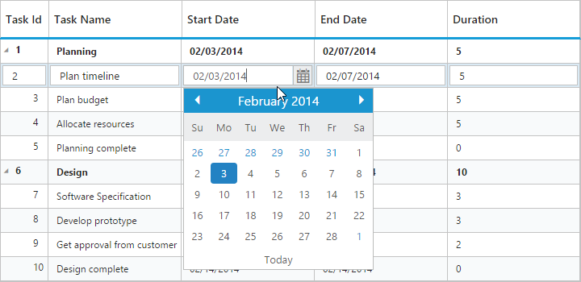
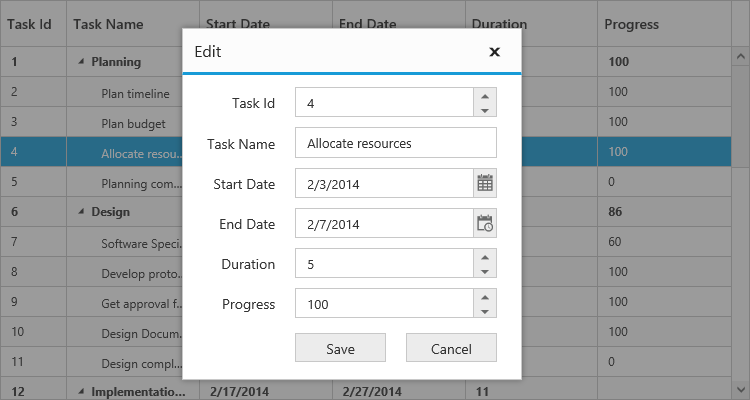

# Editing

## Editing Modes

TreeGrid provides support to add, edit and delete the records and the folllowing are the types of editing modes available, 

* Cell Editing
* Row Editing
* Dialog Editing

You can enable editing in TreeGrid by enabling the property `EditSettings.AllowEditing`.

### Cell Editing

Update the record details through cell editing by setting `EditSettings.EditMode` as `CellEditing`.

The following code example shows you how to enable cell editing in TreeGrid control.



<ej:TreeGrid runat="server" ID="TreeGridControlEditing">

    //...

    <EditSettings AllowEditing="true" EditMode="cellEditing"/>

</ej:TreeGrid>



The output of TreeGrid with cell editing is as follows.

 

### Row Editing

It is possible to make the entire row to editable state and to update a record by setting `EditSettings.EditMode` as `rowEditing`.

The following code example shows you how to enable rowEditing in TreeGrid control.



<ej:TreeGrid runat="server" ID="TreeGridControlEditing">

    //...

    <EditSettings AllowEditing="true" EditMode="rowEditing"/>

</ej:TreeGrid>



The following output is displayed as a result of the above code example.

### Dialog Editing

Set `EditSettings.EditMode` as `dialogEditing` to edit/add a record using dialog.

The following code example shows you how to enable dialog editing in TreeGrid control.



<ej:TreeGrid runat="server" ID="TreeGridControlEditing">
    //...
    <EditSettings AllowEditing="true" EditMode="dialogEditing" />
</ej:TreeGrid>



The output of the TreeGrid with dialog editing is as follows.

#### Dialog Template

You can edit any of the fields pertaining to a single record of data and apply it to a template so that the same format is applied to all the other records that you may edit later.
Using this template support, you can edit/add the fields that are not bound to TreeGrid columns.
To edit/add the records using dialog template form, set `EditSettings.EditMode` as `dialogEditing` and specify the template id to `EditSettings.DialogEditorTemplateID` property.

N> 1. `value` attribute is used to bind the corresponding field value while editing.
N> 2. `name` attribute is used to get the changed field values while saving the edited record.
N> 3.  `id` attribute must to be set in the format of ( treegrid control id + fieldname).

The following code example describes the above behavior.







<ej:TreeGrid runat="server" ID="TreeGridControlEditing">
    //...
    <EditSettings AllowEditing="true" EditMode="dialogEditing" DialogEditorTemplateID="template"/>
</ej:TreeGrid>



The following output is displayed as a result of the above code example.

