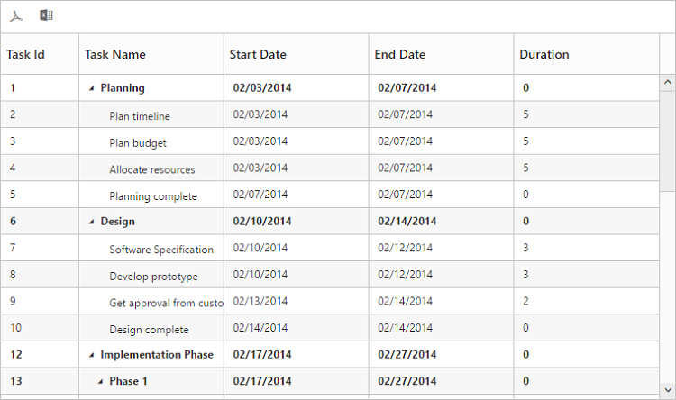

# Export

Exporting feature provides support to export TreeGrid content to excel and PDF files. To export the contents, the `ExcelExport` and `PdfExport` toolbar items must be added in the toolbar using the `ToolbarItems` property of `ToolbarSettings`. When you click, the toolbar exporting icons, it internally invokes the export public method of TreeGrid object to export.

The below code snippet explains the above behavior,




<ej:TreeGrid runat="server" ID="TreeGridControlExporting" ChildMapping="SubTasks" TreeColumnIndex="1" IsResponsive="true" OnServerPdfExporting="TreeGridControlExporting_ServerPdfExporting" OnServerExcelExporting="TreeGridControlExporting_ServerExcelExporting" >
            <Columns>
                <ej:TreeGridColumn HeaderText="Task Id" Field="TaskID" Width="80" />
                <ej:TreeGridColumn HeaderText="Task Name" Field="TaskName" />
                <ej:TreeGridColumn HeaderText="Start Date" Field="StartDate" />
                <ej:TreeGridColumn HeaderText="End Date" Field="EndDate" />
                <ej:TreeGridColumn HeaderText="Duration" Field="Duration" />
            </Columns>
            <EditSettings AllowDeleting="false" />
            <SizeSettings Width="100%" Height="450px" />
            <ToolbarSettings ShowToolbar="true" ToolbarItems="pdfExport,excelExport" />
        </ej:TreeGrid>





    public partial class TreeGridExporting : System.Web.UI.Page
    {
        protected void Page_Load(object sender, EventArgs e)
        {
            TaskDetailsCollection TaskCollection = new TaskDetailsCollection();
            this.TreeGridControlExporting.DataSource = TaskCollection.GetDataSource();
            this.TreeGridControlExporting.DataBind();
        }

        protected void TreeGridControlExporting_ServerPdfExporting(object sender, Syncfusion.JavaScript.Web.TreeGridEventArgs e)
        {
            PdfExport exp = new PdfExport();
            TreeGridExportSettings settings = new TreeGridExportSettings();
            settings.Theme = ExportTheme.FlatLime;
            exp.Export(this.TreeGridControlExporting.Model, (IEnumerable)this.TreeGridControlExporting.DataSource, settings, "Export");
        }

        protected void TreeGridControlExporting_ServerExcelExporting(object sender, Syncfusion.JavaScript.Web.TreeGridEventArgs e)
          {
            ExcelExport exp = new ExcelExport();
            TreeGridExportSettings settings = new TreeGridExportSettings();
            settings.Theme = ExportTheme.FlatLime;
            exp.Export(this.TreeGridControlExporting.Model, (IEnumerable)this.TreeGridControlExporting.DataSource, "Export.xlsx", ExcelVersion.Excel2010, new TreeGridExportSettings() { Theme = ExportTheme.BootstrapTheme });
          }
    }


 

The below screen shot shows TreeGrid with excel and Pdf exporting enabled.

## Server dependencies
Export Helper functions are available in the Assembly `Syncfusion.EJ.Export`, which is available in the Essential Studio & Essential ASP.NET builds. The list of assemblies needed for TreeGrid Export as follows

* Syncfusion.EJ
* Syncfusion.EJ.Export
* Syncfusion.Linq.Base
* Syncfusion.Compression.Base
* Syncfusion.XlsIO.Base
* Syncfusion.PDF.Base

## Supported Export Types
Currently server helper function allows following two types of exporting.

* Excel
* PDF

## Multiple exporting
Multiple export is used for export more than one TreeGrid object in the same file. 

The following code example describes exporting multiple TreeGrid in PDF

 


    

        <ej:TreeGrid runat="server" ID="TreeGridControlExporting" ChildMapping="SubTasks" TreeColumnIndex="1" IsResponsive="true" OnServerPdfExporting="TreeGridControlExporting_ServerPdfExporting">
            <Columns>
                <ej:TreeGridColumn HeaderText="Task Id" Field="TaskID" Width="80"/>
                <ej:TreeGridColumn HeaderText="Task Name" Field="TaskName" />
                <ej:TreeGridColumn HeaderText="Start Date" Field="StartDate" />
                <ej:TreeGridColumn HeaderText="End Date" Field="EndDate" />
                <ej:TreeGridColumn HeaderText="Duration" Field="Duration"/>
            </Columns>
            <EditSettings AllowDeleting="false" />
            <SizeSettings Width="100%" Height="250px" />
            <ToolbarSettings ShowToolbar="true" ToolbarItems="pdfExport" />
        </ej:TreeGrid>
    

   
     

        <ej:TreeGrid runat="server" ID="TreeGridControlDesign" ChildMapping="SubTasks" TreeColumnIndex="1" EnableResize="true">
            <Columns>
                <ej:TreeGridColumn HeaderText="Task Id" Field="TaskID" Width="80"/>
                <ej:TreeGridColumn HeaderText="Task Name" Field="TaskName" />
                <ej:TreeGridColumn HeaderText="Start Date" Field="StartDate" />
                <ej:TreeGridColumn HeaderText="End Date" Field="EndDate" />
                <ej:TreeGridColumn HeaderText="Duration" Field="Duration"/>
            </Columns>
            <EditSettings AllowDeleting="false" />
            <SizeSettings Width="100%" Height="200px" />
        </ej:TreeGrid>
    

     
     

        <ej:TreeGrid runat="server" ID="TreeGridControlImplementation" ChildMapping="SubTasks" TreeColumnIndex="1" EnableResize="true">
            <Columns>
                <ej:TreeGridColumn HeaderText="Task Id" Field="TaskID" Width="80"/>
                <ej:TreeGridColumn HeaderText="Task Name" Field="TaskName" />
                <ej:TreeGridColumn HeaderText="Start Date" Field="StartDate" />
                <ej:TreeGridColumn HeaderText="End Date" Field="EndDate" />
                <ej:TreeGridColumn HeaderText="Duration" Field="Duration"/>
            </Columns>
            <EditSettings AllowDeleting="false" />
            <SizeSettings Width="100%" Height="250px" />
        </ej:TreeGrid>
    





   public partial class TreeGridMultipleExporting : System.Web.UI.Page
    {
        protected void Page_Load(object sender, EventArgs e)
        {
            ExportTaskDetailsCollection TaskCollection = new ExportTaskDetailsCollection();
            this.TreeGridControlExporting.DataSource = TaskCollection.GetDataSource();
            this.TreeGridControlExporting.DataBind();
            this.TreeGridControlDesign.DataSource = TaskCollection.GetDesignPhaseDataSource();
            this.TreeGridControlDesign.DataBind();
            this.TreeGridControlImplementation.DataSource = TaskCollection.GetImplementationPhaseDataSource();
            this.TreeGridControlImplementation.DataBind();
        }

        protected void TreeGridControlExporting_ServerPdfExporting(object sender, Syncfusion.JavaScript.Web.TreeGridEventArgs e)
        {
            PdfExport exp = new PdfExport();
            PdfDocument document = exp.Export(this.TreeGridControlExporting.Model, (IEnumerable)this.TreeGridControlExporting.DataSource, new TreeGridExportSettings(){ Theme = ExportTheme.FlatLime},false,"Planning Phase");
            document = exp.Export(this.TreeGridControlDesign.Model, (IEnumerable)this.TreeGridControlDesign.DataSource, new TreeGridExportSettings() { Theme = ExportTheme.FlatLime }, "Export", document, false, "Design Phase");
            exp.Export(this.TreeGridControlImplementation.Model, (IEnumerable)this.TreeGridControlImplementation.DataSource, new TreeGridExportSettings() { Theme = ExportTheme.FlatLime }, "Export", document, true, "Implementation Phase");
        }
    }


 

You can also find the sample demo for multiple exporting in TreeGrid [here](http://asp.syncfusion.com/demos/web/treegrid/treegridmultipleexporting.aspx).

## Export Theme
The TreeGrid export supports the below themes, 

* flat-azure
* flat-azure-dark
* flat-lime
* flat-lime-dark
* flat-saffron
* flat-saffron-dark
* gradient-azure
* gradient-azure-dark
* gradient-lime
* gradient-lime-dark
* gradient-saffron
* gradient-saffron-dark
* bootstrap-theme

The desired theme should be passed as a parameter to the Export method and the code snippet for this as follows



        protected void TreeGridControlExporting_ServerPdfExporting(object sender, Syncfusion.JavaScript.Web.TreeGridEventArgs e)
        {
            PdfExport exp = new PdfExport();
            TreeGridExportSettings settings = new TreeGridExportSettings();
            settings.Theme = ExportTheme.FlatLime;
            exp.Export(this.TreeGridControlExporting.Model, (IEnumerable)this.TreeGridControlExporting.DataSource, settings, "Export");
        }

        protected void TreeGridControlExporting_ServerExcelExporting(object sender, Syncfusion.JavaScript.Web.TreeGridEventArgs e)
          {
            ExcelExport exp = new ExcelExport();
            TreeGridExportSettings settings = new TreeGridExportSettings();
            settings.Theme = ExportTheme.FlatLime;
            exp.Export(this.TreeGridControlExporting.Model, (IEnumerable)this.TreeGridControlExporting.DataSource, "Export.xlsx", ExcelVersion.Excel2010, new TreeGridExportSettings() { Theme = ExportTheme.BootstrapTheme });
          }

