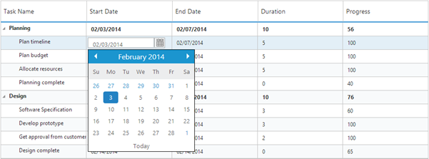

# Getting Started

## Create your first TreeGrid in ASP.NET

This section explains how to create a TreeGrid control in your application with hierarchical data source and enable sorting and editing in TreeGrid control using ASP.NET. The following screenshot displays the output.

1. First create a new ASP.NET Web Form project; please refer the [ASP-Getting Started documentation](http://help.syncfusion.com/js) to create new project and add necessary DLL’s and script files.

2. Create the web form  named as default and add the following template

   ~~~ html

		<%@ Page Language="C#" AutoEventWireup="true" CodeBehind="default.aspx.cs"Inherits="Gantt_ASP.TreeGrid._default" %>

		<!DOCTYPE html>

		<html xmlns="http://www.w3.org/1999/xhtml">

		<head id="Head1" runat="server">   

		    <title>Getting started for ASP.NET TreeGrid Control</title>

		    <link href=" http://cdn.syncfusion.com/13.1.0.21/js/web/flat-azure/ej.web.all.min.css" rel="stylesheet" />

		    

		    

		    

		    

		    

		</head>

   ~~~

3. Initialize the TreeGrid with empty dataSource like below code snippet

   ~~~ html

		//...

		<body>

			<form id="form1" runat="server">

			 <ej:TreeGrid runat="server" ID="TreeGridControlDefault" ChildMapping="SubTasks" TreeColumnIndex="1">

					<columns>

						<ej:TreeGridColumn HeaderText="Task Id" Field="TaskID" Width="45" />

						<ej:TreeGridColumn HeaderText="Task Name" Field="TaskName" />

						<ej:TreeGridColumn HeaderText="Start Date" Field="StartDate" />

						<ej:TreeGridColumn HeaderText="End Date" Field="EndDate" />

						<ej:TreeGridColumn HeaderText="Duration" Field="Duration" />

						<ej:TreeGridColumn HeaderText="Progress" Field="Progress" />

					</columns>            

				</ej:TreeGrid>

			</form>

		</body>

   ~~~

    

4. Create data  source in default.aspx.cs file and assign the data source to the TreeGrid control



protected void Page_Load(object sender, EventArgs e)

{

    TaskDetailsCollection TasksCollection = new TaskDetailsCollection();

    this.TreeGridControlDefault.DataSource = TasksCollection.GetDataSource();

    this.TreeGridControlDefault.DataBind();

}

public class TaskDetails

{

    public int TaskID { get; set; }

    public string TaskName { get; set; }

    public string StartDate { get; set; }

    public string EndDate { get; set; }

    public int Duration { get; set; }

    public int Progress { get; set; }

    public List<TaskDetails> SubTasks { get; set; }

}

public class TaskDetailsCollection

{

    public List<TaskDetails> GetDataSource()

    {

        List<TaskDetails> tasks = new List<TaskDetails>();

        tasks.Add(new TaskDetails()

        {

            TaskID = 1,

            TaskName = "Planning",

            StartDate = "02/03/2014",

            EndDate = "02/07/2014",

            Progress = 56,

            Duration = 5,

        });

        tasks[0].SubTasks = new List<TaskDetails>();

        tasks[0].SubTasks.Add(new TaskDetails()

        {

            TaskID = 2,

            TaskName = "Plan timeline",

            StartDate = "02/03/2014",

            EndDate = "02/07/2014",

            Duration = 5,

            Progress = 100

        });

        tasks[0].SubTasks.Add(new TaskDetails()

        {

            TaskID = 3,

            TaskName = "Plan budget",

            StartDate = "02/03/2014",

            EndDate = "02/07/2014",

            Duration = 5,

            Progress = 100

        });

        tasks[0].SubTasks.Add(new TaskDetails()

        {

            TaskID = 4,

            TaskName = "Allocate resources",

            StartDate = "02/03/2014",

            EndDate = "02/07/2014",

            Duration = 5,

            Progress = 100

        });

        tasks[0].SubTasks.Add(new TaskDetails()

        {

            TaskID = 5,

            TaskName = "Planning complete",

            StartDate = "02/07/2014",

            EndDate = "02/07/2014",

            Duration = 0,

            Progress = 40

        });

        tasks.Add(new TaskDetails()

        {

            TaskID = 6,

            TaskName = "Design",

            StartDate = "02/10/2014",

            EndDate = "02/14/2014",

            Duration = 3,

            Progress = 86

        });

        tasks[1].SubTasks = new List<TaskDetails>();

        tasks[1].SubTasks.Add(new TaskDetails()

        {

            TaskID = 7,

            TaskName = "Software Specification",

            StartDate = "02/10/2014",

            EndDate = "02/12/2014",

            Duration = 3,

            Progress = 60

        });

        tasks[1].SubTasks.Add(new TaskDetails()

        {

            TaskID = 8,

            TaskName = "Develop prototype",

            StartDate = "02/10/2014",

            EndDate = "02/12/2014",

            Duration = 3,

            Progress = 100

        });

        tasks[1].SubTasks.Add(new TaskDetails()

        {

            TaskID = 9,

            TaskName = "Get approval from customer",

            StartDate = "02/13/2014",

            EndDate = "02/14/2014",

            Duration = 2,

            Progress = 100

        });

        tasks[1].SubTasks.Add(new TaskDetails()

        {

            TaskID = 10,

            TaskName = "Design complete",

            StartDate = "02/14/2014",

            EndDate = "02/14/2014",

            Duration = 0,

            Progress = 65

        });

        return tasks;

    }

}
		


A TreeGrid is displayed as the output in the following screenshot.

### Enable Sorting

The TreeGrid control has sorting functionality, to arrange the data in ascending or descending order based on a particular column.

### Multicolumn Sorting

Enable the multicolumn sorting in TreeGrid by setting AllowMultiSorting as True. You can sort multiple columns in TreeGrid, by selecting the desired column header 	while holding the CTRL key.



<ej:TreeGrid runat="server" ID="TreeGridControlDefault"

     //...

    AllowSorting="true"

    AllowMultiSorting="true">          

</ej:TreeGrid>



 

### Enable Editing

You can enable Editing in TreeGrid by using the EditSettings as follows.



<ej:TreeGrid runat="server" ID="TreeGridControlDefault" ChildMapping="SubTasks" TreeColumnIndex="1">

       //...

    <EditSettings AllowEditing="true" EditMode="CellEditing"/>

</ej:TreeGrid>



And also, the following editors are provided for support in TreeGrid control.

* stringedit
* booleanedit
* numericedit
* dropdownedit
* datepicker

You can set the editor type for a particular column as follows.



<ej:TreeGrid runat="server" ID="TreeGridControlDefault" ChildMapping="SubTasks" TreeColumnIndex="1">

    //...

       <columns>

           <ej:TreeGridColumn HeaderText="Task Id" Field="TaskID" Width="45" EditType="Numeric"/>

           <ej:TreeGridColumn HeaderText="Task Name" Field="TaskName" EditType="String"/>

           <ej:TreeGridColumn HeaderText="Start Date" Field="StartDate" EditType="Datepicker"/>

           <ej:TreeGridColumn HeaderText="End Date" Field="EndDate" EditType="Datepicker"/>

           <ej:TreeGridColumn HeaderText="Duration" Field="Duration" EditType="Numeric" />

           <ej:TreeGridColumn HeaderText="Progress" Field="Progress" EditType="Numeric"/>

       </columns>                     

</ej:TreeGrid>



The output of the DateTimePicker editor in TreeGrid control is as follows.

 