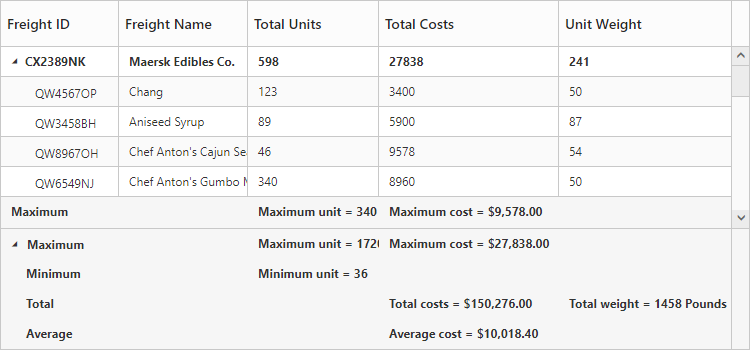

# Summary Row

Summary rows in TreeGrid is used to summarize every hierarchy with the set of predefined summary types using the column values. 

* `SummaryRows` - Using this property, user can define the summary rows in TreeGrid.
* `SummaryRows.Title` - Title for each summary row can be defined using this property. 
* `SummaryRows.SummaryColumns` - Using this property, it is possible to defined the summary for specific columns alone in a summary row.
* `ShowSummaryRow` - This property is to make the summary row visible. 
* `ShowTotalSummary` - This property is to make the total summary row visible which is the overall summary row displayed for all the rows in the TreeGrid content.

## Defining summary columns

* `SummaryType` - Using this property, user can define the type of summary to be displayed in a column. 
* `DataMember`- This property is used to map the field values which is used for summary calculations.
* `DisplayColumn`- This property is used to specify the column in which the summary to be displayed.
* `Prefix` and `Suffix` properties are used to define the text should be displayed along with the summary column value.
* `Format`- property is used for formatting the summary column value.

The below code snippet explains defining a summary row in TreeGrid,

 <ej:TreeGrid runat="server" ShowSummaryRow="true" ShowTotalSummary="true" ID="TreeGridControlSummaryRow">             
            <SummaryRows>               
               <ej:TreeGridSummaryRow Title="Maximum">
                   <SummaryColumn>
                       <ej:TreeGridSummaryColumn SummaryType="Maximum" DataMember="TotalUnits" DisplayColumn="TotalUnits"  Prefix="Maximum unit = "/>                      
                   </SummaryColumn> 
                   <SummaryColumn>
                       <ej:TreeGridSummaryColumn SummaryType="Maximum" DataMember="TotalCosts" DisplayColumn="TotalCosts" Prefix="Maximum Cost = " Format="{0:C}" />
                    </SummaryColumn>              
                </ej:TreeGridSummaryRow>
                <ej:TreeGridSummaryRow Title="Total">
                    <SummaryColumn>
                        <ej:TreeGridSummaryColumn SummaryType="Sum" DataMember="TotalCosts" DisplayColumn="TotalCosts" Prefix="Total costs =  " Format= "{0:C}" />
                        <ej:TreeGridSummaryColumn SummaryType="Sum" DataMember="UnitWeight" DisplayColumn="UnitWeight" Prefix="Total weight = " Suffix=" Pounds" />
                    </SummaryColumn>
                </ej:TreeGridSummaryRow>
            </SummaryRows>                   
        </ej:TreeGrid>    
   

The below screenshot shows the output of above code example.

## Customize height of total summary

Using `TotalSummaryHeight` property we can customize the height of the total summary container.
The below code example shows how to update the footer summary container height.

  <ej:TreeGrid runat="server" ID="TreeGridControlSummaryRow"
            ShowSummaryRow="true" 
			ShowTotalSummary="true" 
			TotalSummaryHeight="120">
			//..
  </ej:TreeGrid>  

The below screenshot shows the output of above code example.

## Expand/collapse total summary row

We can expand/collapse the total summary rows in TreeGrid using following methods.

* Using Expander Icon
* Using Method

### Using Expander Icon
We can enable expander icon in total summary row by using `CollapsibleTotalSummary` property. By default expander icon will be rendered in first row of 0th column in total summary rows.
Please find the below code example to enable collapsible total summary row in TreeGrid.

  <ej:TreeGrid runat="server" ID="TreeGridControlSummaryRow"
            ShowSummaryRow="true" 
			ShowTotalSummary="true" 
			TotalSummaryHeight="120"
			CollapsibleTotalSummary="true" >
			//..
  </ej:TreeGrid>  


N> We can also customize the expander icon column in total summary row by using `_summaryColumnIndex` property and `Load` event.

### Using  Method

Total summary rows in TreeGrid can be expanded/collapsed by using [`expandCollapseTotalSummary`](https://help.syncfusion.com/api/js/ejgantt#methods:expandCollapseTotalSummary "expandCollapseTotalSummary") method.
Please find the code example to collapse the total summary rows below.
  

  <button onclick="expandCollapse()">expandCollapse</button>
  
  <ej:TreeGrid runat="server" ID="TreeGridControlSummaryRow"
            ShowSummaryRow="true" 
			ShowTotalSummary="true" 
			TotalSummaryHeight="120"
			CollapsibleTotalSummary="true" >
			//..
  </ej:TreeGrid>  
    function expandCollapse() {
            var treeObj = $("#TreeGridContainer").data("ejTreeGrid");
            treeObj.expandCollapseTotalSummary(false);
        }


[Click](https://asp.syncfusion.com/demos/web/treegrid/treegridsummaryrow.aspx) here to view the demo sample for summary row in TreeGrid.