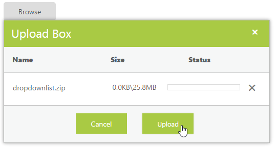
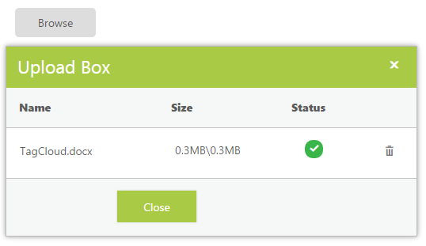

# Auto Upload

The UploadBox control provides support to upload the file automatically once the file is selected by using the browse button, that is, without clicking the upload button. To achieve this, set the AutoUpload property to true. The data type is Boolean. 

By default, the value is set to false, and so the Upload button is clicked to upload the files. In the following code block, the AutoUpload is set to false so that the selected file is uploaded only on Upload button click.



<ej:UploadBox ID="Uploadbox" runat="server" SaveUrl="SaveFiles.ashx" RemoveUrl="RemoveFiles.ashx" AutoUpload="false" >

</ej:UploadBox>   

 

The following screenshot displays the output when AutoUpload is set to false.

The following steps explain the configuration of the AutoUpload property in the UploadBox

In the ASPX page, add the UploadBox element.



<ej:UploadBox ID="Uploadbox" runat="server" SaveUrl="SaveFiles.ashx" RemoveUrl="RemoveFiles.ashx" AutoUpload="true" >

</ej:UploadBox>  

  

> Note: The SaveUrl and RemoveUrl are the same as above (see Save File Action and Remove File Action section).

The following screenshot displays the output.

