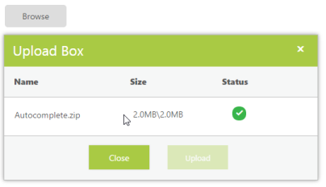
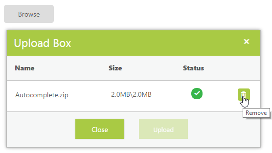

## File Actions

### Save File Action 

To save the uploaded file, create the handlers class and trigger the same in the SaveUrl property.  In those handlers, save and specify the target location for the uploaded files. Its data type is string type.

The following steps explain the configuration of the SaveUrl property in the UploadBox

In the ASPX page, add the UploadBox element.

&lt;ej:UploadBox ID="Uploadbox" runat="server" SaveUrl="SaveFiles.ashx" &gt; &lt;/ej:UploadBox&gt;

Configure the handler to save the file as SaveFiles.ashx. Create a folder (for example, uploadfiles) and save the uploaded files into this folder.  

public class SaveFiles : IHttpHandler {

    public void ProcessRequest(HttpContext context)

    {

        string targetFolder = HttpContext.Current.Server.MapPath("uploadfiles");

        if (!System.IO.Directory.Exists(targetFolder))

        {

            System.IO.Directory.CreateDirectory(targetFolder);

        }

        HttpRequest request = context.Request;

            HttpFileCollection uploadedFiles = context.Request.Files;

            if (uploadedFiles != null && uploadedFiles.Count > 0)

            {

                for (int i = 0; i < uploadedFiles.Count; i++)

                {

                    string fileName = uploadedFiles[i].FileName;

                    int indx = fileName.LastIndexOf("\\");

                    if (indx > -1)

                    {

                        fileName = fileName.Substring(indx + 1);

                    }

                    uploadedFiles[i].SaveAs(targetFolder + "\\" + fileName);

                }

            }

    }

    public bool IsReusable

    {

        get

        {

            return false;

        }

    }

}

The following screenshot displays the output. 

{  | markdownify }
{:.image }

### Remove File Action 

To remove the uploaded file, create the handlers class and trigger the same in the RemoveUrl property.  In the handlers, remove the file where you have saved the uploaded file. This can be achieved by clicking the remove button on upload dialog. Its data type is string type.

The following steps explains the configuration of the RemoveUrl property in the UploadBox

In the ASPX page, add the UploadBox element.

&lt;ej:UploadBox ID="Uploadbox" runat="server" SaveUrl="SaveFiles.ashx" RemoveUrl="RemoveFiles.ashx"&gt; &lt;/ej:UploadBox&gt;  

Configure the handlers to remove the file from the target location named, RemoveFiles.ashx. From that location, the file is searched and removed from the uploadfiles folder.

public class RemoveFiles : IHttpHandler {

    public void ProcessRequest(HttpContext context)

    {

        System.Collections.Specialized.NameValueCollection s = context.Request.Params;

        string fileName = s["fileNames"];

        string targetFolder = HttpContext.Current.Server.MapPath("uploadfiles");

        if (!System.IO.Directory.Exists(targetFolder))

        {

            System.IO.Directory.CreateDirectory(targetFolder);

        }

        string physicalPath = targetFolder + "\\" + fileName;

        if (System.IO.File.Exists(physicalPath))

        {

            System.IO.File.Delete(physicalPath);

        }

    }

    public bool IsReusable {

        get {

            return false;

        }

    }

}

The following screenshot displays the output. 

{  | markdownify }
{:.image }

