# Utility

The Syncfusion ASP.NET Utilities provide quick access to create or configure the Syncfusion ASP.NET projects. The Syncfusion ASP.NET utility have the following features.

1. Syncfusion Project Conversion for ASP.NET Web Application
2. Syncfusion Project Migration for ASP.NET Web Application
3. Sample Creator

## Project Conversion

Syncfusion provides the Project Conversion add-on with Visual Studio that will converts an existing ASP.NET project into a Syncfusion ASP.NET (EJWEB) project by adding the required assemblies and resource files.

I>	The Syncfusion ASP.NET Web Application Project Conversion utility is available from v13.1.0.30.

### Convert into Syncfusion ASP.NET Project 

The following steps direct you to use the Syncfusion Project Conversion in the existing ASP.NET Project.

1. Open an existing Microsoft ASP.NET Project or create a new Microsoft ASP.NET Project.

2. Right-click the **Project** from Solution Explorer and select **Syncfusion VS Extensions**, then choose the **Convert to Syncfusion ASP.NET Application**. Refer to the following screenshot for more information.

   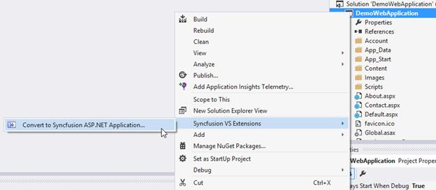

3. Project Conversion Wizard opens to configure the project.

   

The following configurations are used in the Project Conversion Wizard.

   **Assemblies From:**

   Choose the assembly location:

   * Added From GAC: Refer to the assemblies from Global Assembly Cache.

   * Added from Installed Location: Refer to the assemblies from Syncfusion Installed locations.

   * Add Referenced Assemblies to Solution: Copy and refer to the assemblies from project's solution file lib directory.
   
   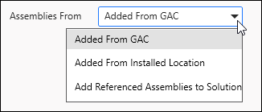
   
   **Choose the Theme:**
   
   The master page of project will be updated based on the selected theme. The Theme Preview section shows the controls preview before converting to a Syncfusion project
   
   

   **Choose CDN Support:**

   The master page of the project will be updated based on required Syncfusion CDN links.

   
 
   **Choose Copy Global Resources:**
    
   The localization culture files will be shipped into Scripts\ej\i18n directory of the project.

   

4. Choose the required controls from Components section and Click the **Convert** button to convert it into a Syncfusion Project.

   
   
   The **Project Backup** dialog will be opened. Click Yes to backup the current project before converting it to Syncfusion project, and click No to convert the project to Syncfusion project without backup.
   
   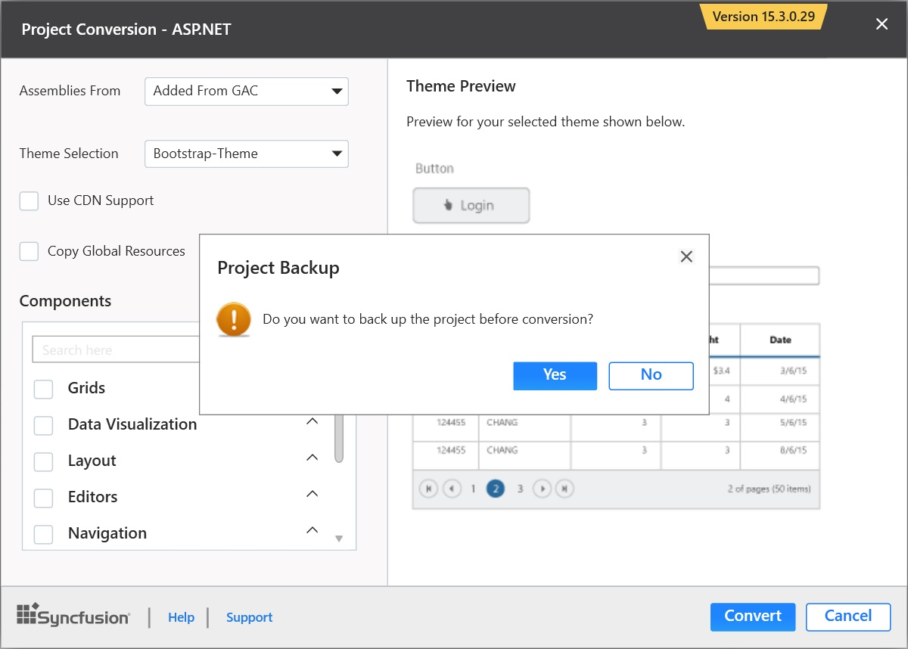

5. The required Syncfusion Reference Assemblies, Scripts and CSS are included in the ASP.NET Project. Refer to the following screenshots for more information.

   

   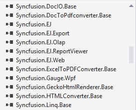

   

### Rendering Control after Syncfusion ASP.NET Conversion

Once you converted your ASP.NET Project to Syncfusion ASP.NET Project using Syncfusion Visual Studio Extension, perform the following steps to render the Syncfusion controls to your project.

1. The CSS, Scripts, Syncfusion References, and required Web.config file entries are added to your project by the Syncfusion ASP.NET Conversion.

2. Add the required CSS and Script files references in master page (Site.Master file) of the project. Refer to the following screenshot for more information.

   
   
3. Now, include the Syncfusion controls to your project. Refer to the following screenshot for more information.

   

4. Run the project, and the following output will be displayed.

   

## Project Migration

Syncfusion provides the Project Migration add-on with the Visual Studio that will easily migrate the existing Syncfusion ASP.NET project from one Essential Studio version to another version.

I>	The Syncfusion ASP.NET Web Application Project Migration utility is available from v13.1.0.30.

### Migrate Syncfusion Project 

The following steps direct you to migrate your existing Syncfusion ASP.NET application.

1. Right-click the **Syncfusion ASP.NET Project** from Solution Explorer and select **Syncfusion VS Extensions**. Then choose **Migrate the Project to Another version**.

   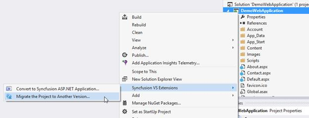

2. The **Project Migration** window appears. Choose the required Essential Studio version that has to be installed in the machine.

   

3. The **Project Migration** window allows you to configure the following options:

   i. **Essential Studio Version:** Select any version from the list of installed versions.
   
   ii. **Assemblies From:** Choose the assembly location from where it is going to be added to the project.
   
4. Click the Migrate Button. The **Project Backup** dialog will be opened. Click Yes to backup the current project before migrating to the Syncfusion project, and click No to migrate the project to required Syncfusion version without backup.
   
   
   
   
5. The Syncfusion Reference Assemblies, Scripts, and CSS are updated to the corresponding version in the project.

## Sample Creator

Syncfusion provides support for Sample Creator utility that allows you to create Syncfusion ASP.NET Projects along with the samples based on Controls and Features selection.

### Create Syncfusion ASP.NET Web Project from Sample Creator

Sample Creator can be downloaded from the Syncfusion Dashboard. After installing the complete Essential Studio suite or ASP.NET setup, the following steps will help you to create the Syncfusion ASP.NET Project via the Sample Creator utility.

1. Launch the Syncfusion Essential Studio Dashboard and select the ASP.NET platform. Then, select the **Sample Creator** button to launch the ASP.NET Sample Creator Wizard. Refer to the following screenshot for more information.

   

2. Syncfusion Sample Creator Wizard displays the **Controls and its Feature Selection** section.

   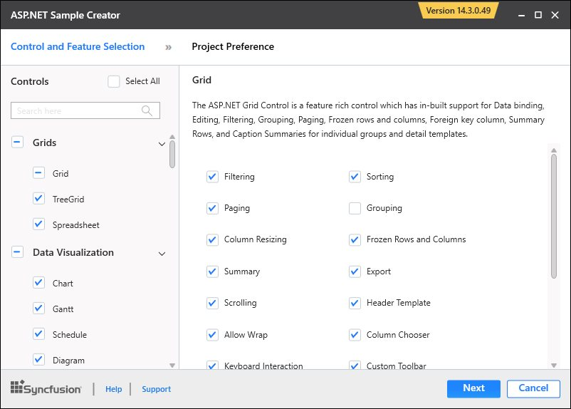

#### Controls selection

Listed here are the Syncfusion ASP.NET controls so you can choose the required controls.

   

#### Feature selection

Based on the controls, the Feature is enabled to choose the features of the corresponding controls.

   

#### Project configuration

1. You can configure the following project details in the Sample Creator.

   * Project Type: Select the type of ASP.NET Project, it can be either Web Application or Web Site.

   * Language: Select the language, either C# or VB.

   * VS Version: Choose the Visual Studio version.

   * .NET Framework: Choose the .NET Framework version.

   * Name: Name your Syncfusion ASP.NET Application.

   * Location: Choose the target location of your project.

   * Theme Selection: Choose the required theme. The Theme Preview section shows the controls preview before creating the Syncfusion project.

   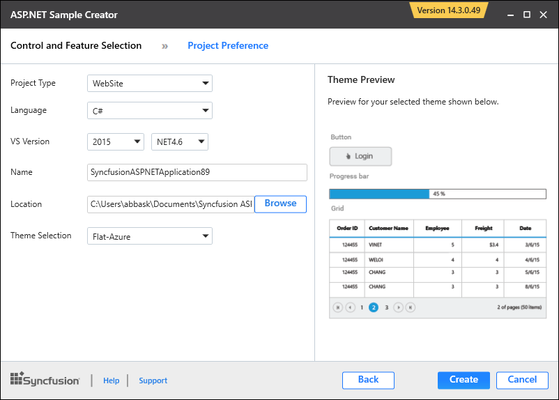

2. When you click the Create button, the new Syncfusion ASP.NET project is created. The following resources are added in the project:

   * Added the required ASPX and Class files in the project.

     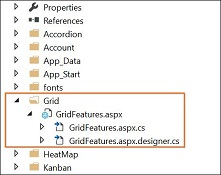

   * Included the required Syncfusion ASP.NET scripts and themes files.

     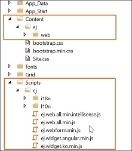

   * The required Syncfusion assemblies are added for selected controls under Project Reference.

     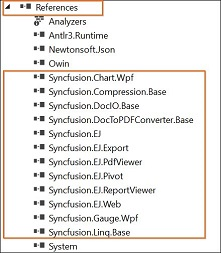

   * Configure the Web.Config file by adding the Syncfusion reference assemblies, namespaces, and controls.

     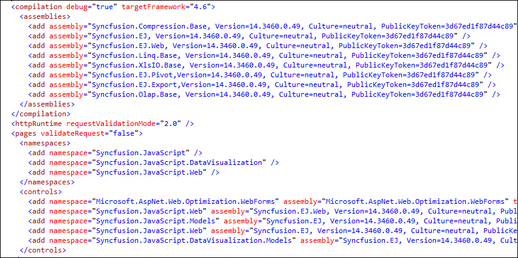

3. Once the project is created, open the project by clicking the Yes button. If you click No button, the corresponding location of the project will be opened. Refer to the following screenshot for more information.

   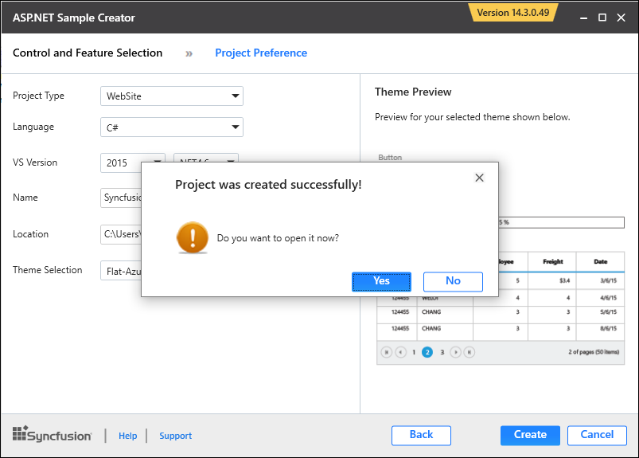

