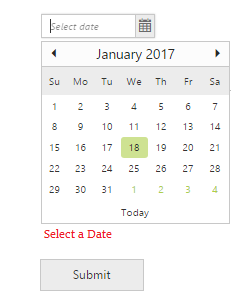

# Validation

Syncfusion controls can be validated in two ways.

1. Using jQuery Validator
2. Using ASP.NET validator

## jQuery validation

To perform the jQuery validation for EJ form controls, please refer to the following steps.

Step 1: First you need to include jquery.validate (1.15.0) script in your HTML page.
Step 2: After adding this script file, you can validate the EJ form controls in same way as you perform the jQuery validation for HTML form elements. But, here you have to do some little bit configuration along with that. This is discussed in the following.

If validation gets fail, you have to place the error message in proper position using “errorPlacement” API that is available in default settings of jQuery validation. Also built-in “error” class will be added to corresponding form element. Here you have to specify a custom class with your own style using “errorClass” API. These are the common settings for all of our EJ form controls.
And some of our EJ form controls contains the form values in hidden element for its functionality purpose and these hidden elements are not validated by default. If you want to include the hidden elements in jQuery validation, you have to set “[]” in “ignore” API of “$.validator.setDefaults”. Refer to the following list to find out the EJ form controls that contains the value in hidden element.

•	Checkbox
•	MaskEdit
•	NumericTextbox
•	CurrencyTextbox
•	PercentageTextbox
•	RTE
•	Dropdownlist

Please refer to the following code block to configure the above mentioned jQuery validation settings.



$.validator.setDefaults({
    //if we don’t set custom class, default “error” class will be added
    errorClass: 'e-validation-error',
    //it specifies the error message display position
    errorPlacement: function (error, element) {
        $(error).insertAfter(element.closest(".e-widget"));
    }
});



Up to 13.4.0.58 version, the above specified jQuery validation settings were configured in source level of EJ form controls. Since 14.1.0.41 release onwards, the above specified settings has been removed from the source and it needs to be specified in sample level to improve the customization of this validation.

Step 3: After configuring above jQuery validation settings, you have to specify the validation rules and messages using the APIs (“validationRules” and “validationMessage”) that is available in the validation supportable EJ controls.

### Validation Rule

A validation rule associates an element with a validation method. For example, validate DatePicker control with the jQuery methods like required, range, etc.

### Validation Messages

Set your own custom error message by using ValidationMessage property. To display the error message, specify the corresponding annotation attribute followed by the message.

N> jQuery predefined error messages to that annotation attribute will be shown when this property is not defined.



<ej:DatePicker ID="datepick" runat="server">
    <ValidationRule> 
        <ej:KeyValue Key="required" Value="true" ></ej:KeyValue>
    </ValidationRule>
    <ValidationMessage>
        <ej:KeyValue Key="required" Value="Please enter the date value" ></ej:KeyValue>
    </ValidationMessage>
</ej:DatePicker>



## ASP Validator

To use ASP.NET validator with the Syncfusion controls, set the ID of the control as the value of the ControlToValidate property of the validator.

To validate the DatePicker control using ASP validator, follow the code sample:



<ej:DatePicker ID="datelocalization ButtonText="Today" HeaderFormat="MMMM yyyy" runat="server"></ej:DatePicker>

<asp:RequiredFieldValidator runat="server" ID="RequiredFieldValidator1" ControlToValidate="datelocalization" ErrorMessage="Select a Date" ></asp:RequiredFieldValidator> 



Executing the above code will validate the DatePicker control values on every form submit before post back occurs as given in the following.

