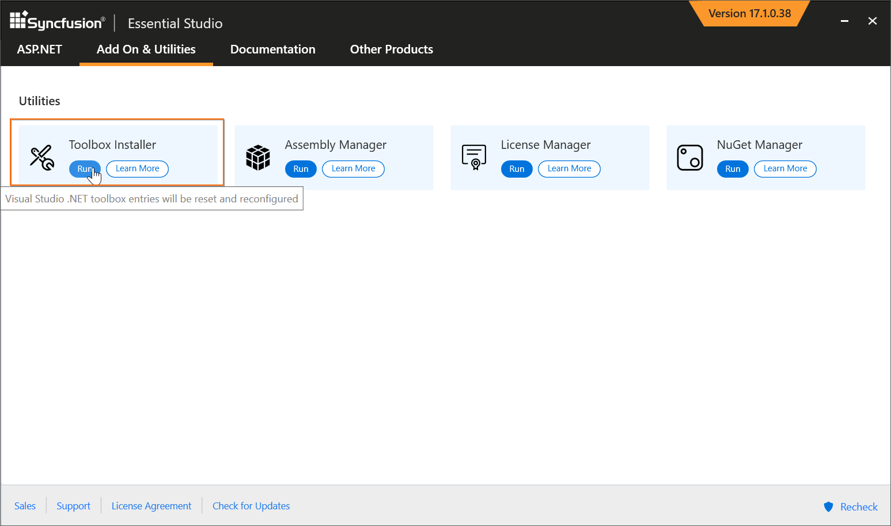
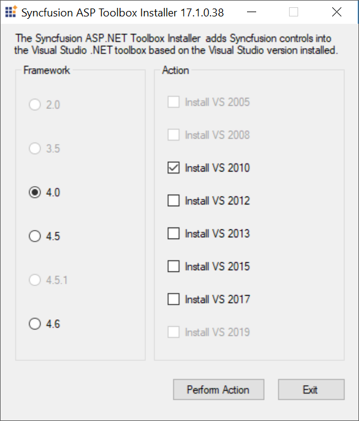
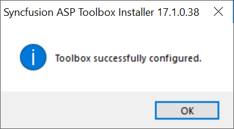

# Toolbox Configuration

The Syncfusion Toolbox Installer utility incorporates the Syncfusion ASP.NET Web Forms components into the Visual Studio.NET toolbox.

N> Toolbox configuration support is not available in the Visual Studio Express Edition. However, you can manually configure the Syncfusion components in the Visual Studio Express Toolbox. To do so, see [Manual Toolbox Configuration](https://help.syncfusion.com/common/faq/how-to-configure-the-toolbox-of-visual-studio-manually).

If the <b>“Configure Syncfusion components in Visual Studio”</b> checkbox is selected from the installer UI while installing the Syncfusion ASP.NET Web Forms installer, Syncfusion components will be automatically configured in the Visual Studio toolbox.

To add the Syncfusion ASP.NET Web Forms components via the Syncfusion Toolbox Installer, perform the following steps:

1. To launch the Toolbox configuration utility, select one of the following options:

   **Option 1:**   
   Open the Syncfusion Control Panel, click **Add On and Utilities > Toolbox Installer**.
   
   
   
   **Option 2:**  
   Click **Syncfusion menu** and choose **Essential Studio for ASP.NET Web Forms (EJ1) > Toolbox Configuration...** in **Visual Studio**

   

   N> From Visual Studio 2019, Syncfusion menu is available under Extensions in Visual Studio menu.

2. Toolbox Installer will be opened.

   

   The following options are available in Toolbox Configuration:

   * Install VS2005 – Configures Framework 2.0 Syncfusion controls in VS 2005 toolbox.
   * Install VS2008 – Configures Framework 3.5 Syncfusion controls in VS 2008 toolbox.
   * Install VS2010 – Configures Framework 4.0 Syncfusion controls in VS 2010 toolbox.
   * Install VS2012 – Configures Framework 4.5 Syncfusion controls in VS 2012 toolbox.
   * Install VS2013 – Configures Framework 4.5.1 Syncfusion controls in VS 2013 toolbox.
   * Install VS2015 – Configures Framework 4.6 Syncfusion controls in VS 2015 toolbox.
   * Install VS2017 – Configures Framework 4.6 Syncfusion controls in VS 2017 toolbox.
   * Install VS2019 – Configures Framework 4.6 Syncfusion controls in VS 2019 toolbox.
   * Install VS2022 – Configures Framework 4.6 Syncfusion components in VS 2022 toolbox.
   
    N> You can also configure Syncfusion components from a lower version Framework assembly to higher version of Visual Studio.
   
3. An Information message is displayed, indicating that Toolbox has been successfully configured. Click OK.

   
   
   
   N> * If your installed controls are not reflected properly in the Visual Studio Toolbox, you'll have to reset the Toolbox. 
   * This tool configures only the components  that are located under {Installed Location}\Assemblies\{Framework version}.
   
## Configuring toolbox in Visual Studio 2022   

From 2021 Volume 3, Syncfusion started providing toolbox support for .NET framework in Visual Studio 2022 Toolbox. After installing the Syncfusion ASP.NET WebForms installer, Syncfusion controls will be automatically configured in the Visual Studio 2022 toolbox for ASP.NET WebForms projects.
   
