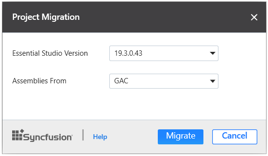

# Upgrading Syncfusion ASP.NET application to latest version

The Syncfusion ASP.NET migration add-in for Visual Studio allows you to migrate an existing Syncfusion ASP.NET application from one version of Essential Studio version to another version. This reduces the amount of manual work required when migrating the Syncfusion version.

I> The Syncfusion ASP.NET Web Application Project Migration utility is available beginning with v13.1.0.30.

To migrate you’re existing Syncfusion ASP.NET application, follow the steps below.

> Before use, the Syncfusion ASP.NET Web Forms Project Migration, check whether the **ASP.NET Web Forms Extensions - Syncfusion** installed or not in Visual Studio Extension Manager by clicking on the Extensions -> Manage Extensions -> Installed for Visual Studio 2019 or later and for Visual Studio 2017 or lower by clicking on the Tools -> Extensions and Updates -> Installed. Also, check whether the corresponding Essential Studio version build installed or not. If the Essential Studio version is not same for both the Extension and build, then the Project Migration will not be shown.

1. To launch Migration Wizard, select one of the following options:

   **Option 1**   
   Click **Extensions->Syncfusion Menu** and choose **Essential Studio for ASP.NET Web Forms (EJ1) > Migrate Project…** in **Visual Studio**.

   

   N> In Visual Studio 2017 or lower, Click Syncfusion Menu and choose Essential Studio for ASP.NET Web Forms (EJ1) > Migrate Project….

   

   **Option 2**  
   Right-click the **Syncfusion ASP.NET Application** from Solution Explorer and select **Syncfusion Web (Essential JS 1)**. Choose **Migrate the Essential JS 1 Project to Another version…**

   

2. The **Project Migration** window appears. You can choose the required Essential Studio version that is installed in the machine.

   

3. The **Project Migration** window allows you to configure the following options:

   i. **Essential Studio Version:** Choose a version from the list of Syncfusion versions that have been installed.
   
   ii. **Assemblies From:** Choose the assembly location, from where the assembly will be added to the project.

    
   
4. Click the **Migrate** Button. The **Project Backup** dialogue box appears. If you select **Yes** in the dialog, it will backup the current project before migrating the Syncfusion project. If you select **No**, the project will be migrated to the required Syncfusion version without a backup.
   
   
   
   
5. The Syncfusion Reference Assemblies, Scripts, and CSS, Web.Config entries in the project are updated to the selected version.

6. If you installed the trial setup or NuGet packages from nuget.org you must register the Syncfusion license key to your project since Syncfusion introduced the licensing system from 2018 Volume 2 (v16.2.0.41) Essential Studio release. Navigate to the [help topic](https://help.syncfusion.com/common/essential-studio/licensing/license-key#how-to-generate-syncfusion-license-key) to generate and register the Syncfusion license key to your project. Refer to this [blog](https://blog.syncfusion.com/post/Whats-New-in-2018-Volume-2-Licensing-Changes-in-the-1620x-Version-of-Essential-Studio.aspx?_ga=2.11237684.1233358434.1587355730-230058891.1567654773) post for understanding the licensing changes introduced in Essential Studio.