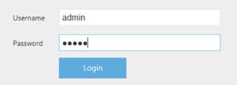
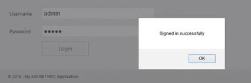

# Getting Started

## Create your first Waiting Popup in ASP.NET  

Essential ASP.NET Waiting Popup provides support to display a Waiting Popup within your web page. From the following guidelines, you can learn how to create a Waiting Popup in the real-time login page authentication scenario.

The following screenshot illustrates the functionality of a Waiting Popup with login page scenario.

 

You can give the Username and Password in the login page. When you click the Login button, you get the Waiting Popup. After loading, the alert box pops up with the message Signed in successfully.

### Create Waiting Popup

You can create a WEB Project and add the necessary assemblies, styles, and scripts with the help of [ASP-Getting Started](http://help.syncfusion.com/aspnetmvc/captcha/getting-started#create-your-first-captcha-in-aspnet-mvc) Documentation.

 Create an aspx page and add the following code to the aspx file.



<div class="content-container-fluid">

        <div class="row">

            <div class="cols-sample-area">

                <table>

                    <tr>

                        <td>

                            Username

                        </td>

                        <td>

                            <input type="text">

                        </td>

                    </tr>

                    <tr>

                        <td>

                            Password

                        </td>

                        <td>

                            <input type="password">

                        </td>

                    </tr>

                    <tr>

                        <td>

                        </td>

                        <td>

                            <ej:Button ID="buttonnormal" runat="server"Type="Button" Text="login" Size="Large"

                                ShowRoundedCorner="true"ClientSideOnClick="btnClick">

                            </ej:Button>

                        </td>

                        <ej:WaitingPopup ID="target" runat="server"ShowOnInit="false">

                        </ej:WaitingPopup>

                    </tr>

                </table>

                <div id="target" class="targetpostion">

                

            

        

     



 Add the following styles in the aspx page to show the Waiting Popup.





The following screenshot displays the User login.

  

### Add Waiting Popup Widget

In a real-time login page scenario, when you click the Login button, the Waiting Popup is displayed.



 



The following screenshot shows the output of the code example.

  

The following screenshot displays an alert box displayed with the message signed in successfully after loading.

 

